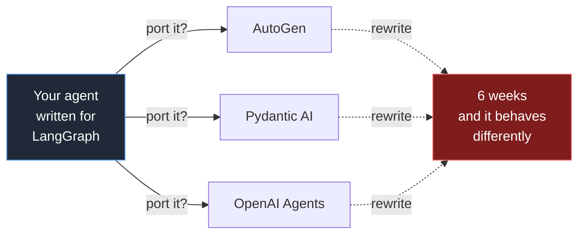
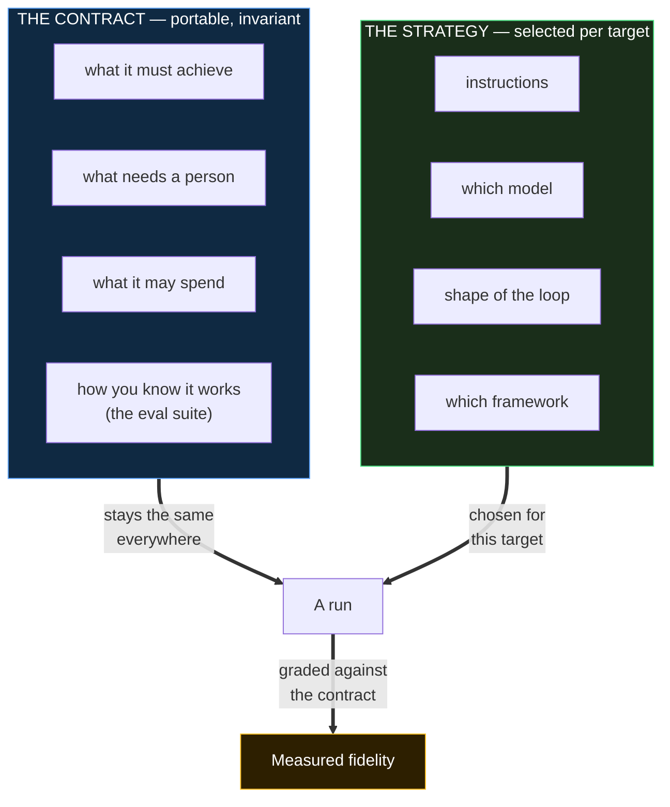
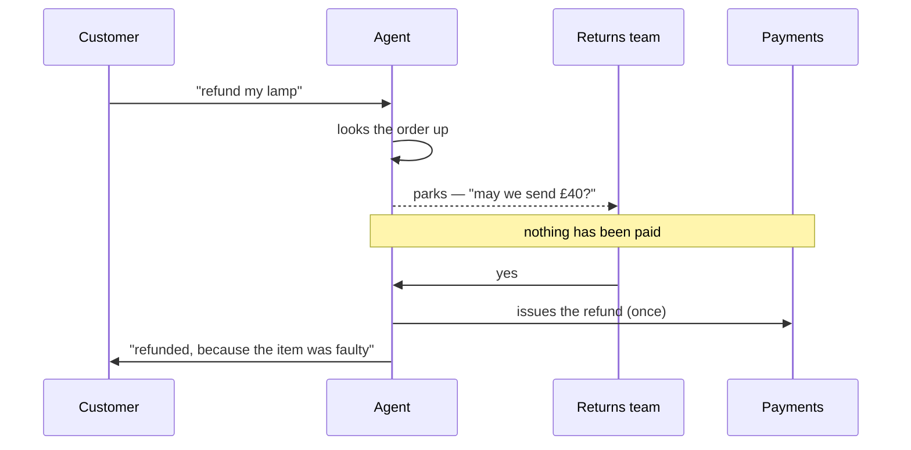
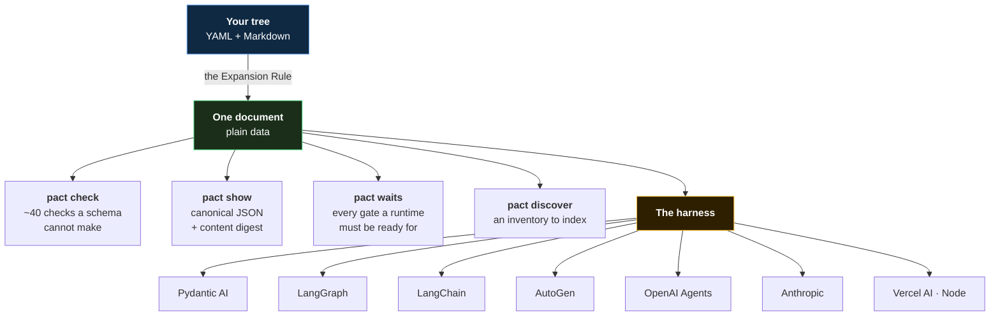

<div align="center">

# PACT

### Portable Agent Contract & Topology

**Write an agent once, as a folder of YAML and Markdown.**
**Run it on seven frameworks. Prove it behaved the same.**

`no code required` · `runs air-gapped` · `every claim measured`

</div>

---

```bash
cargo run -p pact-cli -- check examples/refund-desk
```
```
OK — examples/refund-desk loaded cleanly (498 settings).
```

That example is a supervisor, two specialists, MCP tools, a written refund
policy, an eval suite and a learning policy — **and not one line of code you have
to write**. The single Python file in it is a six-line helper the policy carries
as an attachment; delete it and you still have a working agent.

---

## Contents

| | |
|---|---|
| [Why PACT](#why-pact) | The problem, and why translation between frameworks fails |
| [The idea](#the-idea) | Contract + strategy, and why that split is the whole design |
| [Tutorial](#tutorial-from-nothing-to-a-governed-agent) | Nothing → a governed agent, in four steps you can run |
| [The one rule](#the-one-rule) | A directory is a field; a field may be a directory |
| [What you can express](#what-you-can-express) | The full feature surface, by tier |
| [How it works](#how-it-works) | Tree → document → run, and where each check lives |
| [Portability, measured](#portability-measured) | The capability lattice and what the claim covers |
| [Advantages](#advantages) | What you get that you did not have |
| [Disadvantages](#disadvantages-and-when-not-to-use-pact) | Honest costs, and when to use something else |
| [Compared with](#compared-with) | Eve, LangGraph, CrewAI, A2A, MCP |
| [Status](#status) | What is proven, and what is still owed |

---

## Why PACT

Every serious agent today is written **as a program**, against one framework's
abstractions. That is fine until you need to move it.



**Programs do not translate.** LangGraph's checkpointed state machine, AutoGen's
actor mailbox and Pydantic AI's typed run encode genuinely different semantics.
A transpiler between them would have to invent behaviour, and inventing
behaviour in an agent that spends money is how you get an outage nobody can
explain.

Three more things break at the same time:

| Problem | What it looks like in practice |
|---|---|
| **The author cannot write code** | The person who knows the refund policy is a support lead. Every framework asks them for Python. |
| **The rules live in the code** | "Ask a human before refunding over £200" is an `if` statement in a file nobody in compliance can read. |
| **Nothing is measured** | You swapped the model. Did behaviour change? Nobody can say, so nobody swaps the model. |

---

## The idea

PACT does not model an agent as a program. It models it as a **contract about
behaviour** plus a **plural space of strategies** for satisfying it.



The contract is what travels. The strategy is what gets chosen. And because
agent behaviour is probabilistic, fidelity is **never declared** — it is
**measured against the author's own eval suite**, which becomes the correctness
oracle for framework portability, model substitution and self-improvement alike.

> The closest correct analogy is a **cost-based query planner**. SQL declares
> *what*; the planner chooses *how* against statistics and a cost model. PACT
> declares the agent's *what*; the resolver plans the *how* against a model
> catalogue and an SLO cost model; and evals replace relational algebra as the
> correctness oracle.

---

## Tutorial: from nothing to a governed agent

Four steps. Every command and every output below is real — run them yourself.

### Step 1 — an agent (30 seconds)

Two files. That is a complete, valid agent.

```
my-agent/
├── workspace.yaml
└── agents/helper/agent.yaml
```

```yaml
# workspace.yaml
name: my-first-agent
description: My first PACT agent.
owner: me
```
```yaml
# agents/helper/agent.yaml
description: Answers questions about our returns policy.
instructions: >
  Answer the customer's question about returns. Be brief. Say when you are
  not sure rather than guessing.
```
```bash
pact check my-agent
```
```
OK — my-agent loaded cleanly (8 settings).
```

### Step 2 — give it a tool

Add `tools/orders.yaml`, and one line on the agent saying it may use it.

```yaml
# tools/orders.yaml
description: Looks up an order.
url: https://orders.example.com
method: get
actions:
  find:
    description: Finds one order by its number.
    takes:
      order-number: text
    reads-only: yes
  refund:
    description: Sends the money back.
    takes:
      order-number: text
      amount: money
    spends-money: yes
```
```yaml
# agents/helper/agent.yaml — added
uses:
  - orders
```

Check it, and the format teaches you something:

```
error: 'spends-money' says 'yes', and 'same-request-key' is not set — so nothing
  says which argument makes two calls "the same call".
  --> tools/orders.yaml:15:5
   |
15 |     spends-money: yes
   |     ^^^^^^^^^^^^
  fix: Add a line next to it: `same-request-key: ...` — which argument makes two
       calls "the same call", so it runs once
  rule: schema/missing-companion
```

Declaring that money moves obliges you to say what makes two calls *the same
call*. Add `same-request-key: order-number` and the same refund cannot be sent
twice, even across a crash and a resume.

### Step 3 — make a person approve it

```yaml
# questions/may-we-refund.yaml
description: Asks a person before money moves.
says: This refund is over the desk's limit. May we send it?
answer:
  approved: yes or no
asked-of:
  - the returns team
answer-within: 4h
if-nobody-answers: stop-and-say-so
```
```yaml
# policies/approvals.yaml
ask-a-person:
  - when:
      - tool: orders/refund
    question: may-we-refund
    because: money leaves the company and cannot be taken back
```
```yaml
# agents/helper/agent.yaml — added
policy: approvals
limits:
  cost-per-request-under: 0.05 USD
  steps-at-most: 6
  when-it-runs-out: stop-and-say-so
```

Now ask what a runtime must be prepared to wait for — **before running
anything**:

```bash
pact waits my-agent
```
```
wait: may-we-refund | reason: needs-approval | asked of: ['the returns team']
     | within: 4h | if nobody answers: stop-and-say-so
```

### Step 4 — what actually happens

When that agent runs and reaches the refund, it does not refuse and it does not
guess. It **parks**:



Say **no** instead, and the run finishes, the payment tool is never called, and
the transcript records *"refused: the person answering for the returns team said
no"* — in their own words.

---

## The one rule

> **A directory is a field; a field may be a directory.**

```
   ONE FILE                              A TREE
   ─────────────────────────────         ─────────────────────────────
   agents/helper/agent.yaml              agents/helper/agent.yaml
     description: Answers...      ≡        description: Answers...
     instructions: Be brief.             agents/helper/instructions.md
                                           Be brief.
```

**Both produce the identical document.** A beginner writes one file; an expert
writes a tree; nobody learns a slot table. Any future field gets its directory
form for free — which is what makes the format extensible without touching the
core.

Vercel's Eve proved path-as-identity works, but hard-codes an 18-case slot
table, allows escape hatches only in TypeScript, and — decisively — **its runtime
never reads the authored tree**: it loads generated ESM produced by a build step
that *executes author code*. PACT's tree is executable as-is, and `pact check`
never runs a line of yours.

---

## What you can express

**47 kinds, 306 fields.** 185 are `core` — what a non-technical author writes.
121 are `expert`, and none of them is required for any core capability.

<table>
<tr><th align="left">Capability</th><th align="left">You write</th><th align="left">What it buys</th></tr>
<tr><td><b>Tools</b></td><td><code>tools/*.yaml</code>, <code>uses:</code></td><td>HTTP, MCP servers, or another agent — one vocabulary</td></tr>
<tr><td><b>Written procedures</b></td><td><code>skills/*/SKILL.md</code></td><td>Policy in Markdown a compliance team can read and edit</td></tr>
<tr><td><b>Documents</b></td><td><code>knowledge/*/documents/</code></td><td>A corpus to look things up in, with citation rules</td></tr>
<tr><td><b>Human approval</b></td><td><code>policies/</code>, <code>questions/</code></td><td>The run <i>parks</i>, serialises, and resumes — across a crash</td></tr>
<tr><td><b>Ceilings</b></td><td><code>limits:</code></td><td>Steps, tool calls, tokens, money, wall-clock — enforced, not suggested</td></tr>
<tr><td><b>Redaction</b></td><td><code>redaction.yaml</code></td><td>Card numbers never leave, in plain sentences</td></tr>
<tr><td><b>Rules mid-run</b></td><td><code>interceptors/</code></td><td>Hide, stop, redirect or rewrite — a closed vocabulary of eight sentences</td></tr>
<tr><td><b>Shape of thinking</b></td><td><code>loops/</code></td><td>ReAct, plan-then-do, reflexion, tree-of-thought, and your own</td></tr>
<tr><td><b>Teams</b></td><td><code>team:</code>, <code>teamwork:</code></td><td>Delegation, quorum, races, budget shares — eight worked patterns ship</td></tr>
<tr><td><b>Memory</b></td><td><code>remembers:</code></td><td>A variable a run reads into a call and writes back from one</td></tr>
<tr><td><b>Exact logic</b></td><td><code>programs/</code></td><td>WebAssembly in a locked room, with fuel and a consent gate</td></tr>
<tr><td><b>How you know</b></td><td><code>evals/</code></td><td>The correctness oracle for portability, model swaps and learning</td></tr>
<tr><td><b>Self-improvement</b></td><td><code>learning.yaml</code></td><td>Changes arrive as reviewable diffs, class-gated, never silent</td></tr>
</table>

### Two things worth seeing

**One shape, several desks.** `expects:` declares the holes, `with:` fills them,
`based-on:` inherits by shallow merge, `base: yes` marks a shape nothing runs.
Inheritance, encapsulation and polymorphism — written the way everything else is.

```yaml
# agents/desk-pattern/agent.yaml — a pattern, not a desk
expects:
  domain:    { shape: text,  help: what this desk answers questions about }
  daily-cap: { shape: money, help: the most one request may cost }
description: A desk that answers questions about <domain>.
limits:
  cost-per-request-under: <daily-cap>

# agents/refunds/agent.yaml — one of the desks
based-on: desk-pattern
with:  { domain: refunds, daily-cap: 0.05 USD }
```

**And it erases itself.** A tree written that way and one written out longhand
are not similar — they are *the same document*, down to the digest:

```bash
pact discover tests/trees/two-desks-one-pattern   # sha256:554f1ac71be9a23f…
pact discover tests/trees/two-desks-longhand      # sha256:554f1ac71be9a23f…
```

That is why every claim below — portability, digests, conformance — is true of
trees that use these features, with no special-casing anywhere under the loader.

---

## How it works



**Nothing in that path executes your code.** `pact check` reads a tree and
decides nothing about safety by running anything — which is what makes it safe
to check a workspace a stranger sent you.

Every diagnostic carries **where, what, why and how**. A fix is required by the
constructor's signature, so an unactionable error cannot be built:

```
error: 'measured-at' should be one of: p50, p90, p95, p99, mean, max, but it is some text.
  --> agents/refund-desk/limits.yaml:9:14
  |
9 | measured-at: usually
  |              ^^^^^^^
  fix: Change it to one of: p50, p90, p95, p99, mean, max.
  rule: schema/wrong-type
```

Not everything is a complaint. A **note** says something true that is not wrong,
and `--deny-warnings` stays green for one — a fact printed as a problem teaches
an author to stop reading the output:

```
note: 'refund-policy' holds 5 written rules under `## Rules` — lines a person
  has to approve before they change, whoever or whatever proposes it.
  fix: Nothing to do. Move a rule out from under `## Rules`, or reword that
       heading, and it stops being one — which is how you move this boundary.
```

---

## Portability, measured

One folder, loaded by the Rust CLI, executes over **all seven targets** and
produces *byte-identical traces, tool sequences and model-call counts*. The claim
is bounded and the bound is written down: it covers `instructions:`, `tools:`,
`skills:`, `knowledge:`, `team:`, `answers-with:`, the `loop:` and the `limits:`
ceilings — and **not** the ten governance keys the Node port reports on
`unenforced`, nor the documents under `knowledge/`, which nothing on that port
can look anything up in and which it names on `unretrieved` for every set an
answer did not come from. See
[§7.28 *What "byte-identical across all seven targets" covers, and what it does
not*](docs/20-ARCHITECTURE-DRAFT.md).

That ten counts the **excluded keys**, not the lines a run prints: `team:` is
inside the claim and reported anyway, since the names are offered to the model
and asking one only comes back as an error there — and every `limits:` key that
port does not read gets its own line under a `limits.` prefix.

The conformance suite compares 30 agents × 7 targets = **180 pairs, 0
divergences**, with every exclusion declared rather than discovered.

Each target takes the framework's **lowest** seam, so none of them owns the loop:

| Target | Seam taken |
|---|---|
| Pydantic AI | `direct.model_request` — below `Agent` |
| LangGraph | `func.entrypoint` / `task` — the functional API, not `StateGraph` |
| LangChain | `BaseChatModel` — below chains, AgentExecutor and LCEL |
| AutoGen | `ChatCompletionClient` — below `AssistantAgent` and group chat |
| OpenAI Agents | `models.interface.Model` — below `Runner`, handoffs and guardrails |
| Anthropic | `messages` content blocks — explicitly *not* the hosted session loop |
| Vercel AI SDK | a `LanguageModelV2` provider with `stopWhen: stepCountIs(1)` |

The Vercel target runs in **Node**, so it is a second, independent port of the
same specification — cross-*runtime* agreement, which is a stronger claim than
one implementation agreeing with itself.

Each publishes a capability lattice, and it records real differences rather than
flattering uniformity:

```
              model_cal | tool_call | text_with | parallel_ | streaming | durable_r | connected
reference     native    | native    | native    | native    | unsupport | unsupport | unsupport
pydantic-ai   native    | native    | native    | native    | emulated  | unsupport | native
langgraph     native    | emulated  | native    | emulated  | emulated  | native    | unsupport
langchain     native    | native    | native    | native    | emulated  | unsupport | unsupport
autogen       native    | native    | emulated  | native    | emulated  | unsupport | unsupport
openai-agents native    | native    | native    | native    | emulated  | unsupport | unsupport
anthropic     native    | native    | native    | native    | emulated  | unsupport | unsupport
vercel-ai     native    | native    | native    | native    | emulated  | unsupport | unsupport
```

LangGraph is the only target with native durable resume. AutoGen cannot carry an
assistant sentence *and* tool calls in one result, so its text rides in
`thought` — the value survives and the difference is declared instead of hidden.
Pydantic AI is the only target whose `connect:` reaches a real MCP server.

**The kill test passes on all six Python targets.** Request approval
mid-parallel-tool-batch, serialise the paused state, drop every object, resume in
a fresh transport — each tool executes exactly once, the decision is honoured,
and the resulting history is identical across frameworks.

---

## Advantages

**The author does not write code.** Not "mostly" — every core capability has a
plain-words expression, and a workspace that reaches for an expert feature loses
its `no-code` badge rather than quietly becoming a programming project. That is
enforced by a test over the specification's own tiers.

**The governance is the artefact.** "Ask a person before a refund over £200" is a
file in `policies/`, not an `if` in a codebase. Compliance can read it, diff it
and sign it. `pact waits` lists every gate before anything runs.

**Silent failure is designed out.** A run reports five honesty channels — what it
could not enforce, could not measure, could not retrieve, could not reach, and
what can never be reached at all. A ceiling nothing can measure says so instead
of passing.

**It runs air-gapped.** No network is required to check, load, plan or run
against a local model. Nothing fetches a schema at runtime.

**Model portability is measured, not asserted.** `--choose-model` filters the
catalogue on `needs:`, runs your eval cases against each candidate, refuses when
none passes, and names the cheapest that does.

**Self-improvement emits source.** Every change is a reviewable, revertible diff
to a spec file, classified before it applies. A written rule under a `## Rules`
heading needs a person *however* the edit is made — added, removed, reworded, or
moved by renaming the heading over it.

**Scale is cheap.** A workspace of 525 agent files with a four-level inheritance
chain — 4,923 settings, 521 runnable agents once the patterns resolve away —
checks in **0.26 seconds**, and every one of them runs.

---

## Disadvantages, and when not to use PACT

Written plainly, because a specification that only lists its strengths is
marketing.

### Costs you will actually pay

**It is a specification, and specifications are strict.** You will meet refusals
for things a framework would have let you do. Declaring `spends-money: yes`
obliges you to say what makes two calls the same call. That is the point, and it
is still friction.

**There is a vocabulary to learn.** Not code, but 47 kinds and 306 fields. The
core is 185 of them and the diagnostics name the exact line to type, but "no
code" is not "nothing to learn".

**The eval suite is work, and it is not optional.** Every portability claim is
graded against *your* cases. Write none and PACT cannot tell you whether a model
swap changed anything — it will say `UNDECIDED` rather than guess.

**Evals need a live model.** Checking, loading, planning and digesting are all
offline. Grading is not: with nothing serving models, the verdict is `UNDECIDED`.

**The second port is smaller.** The Node port has no interceptor chain, no
context policy, no approval policy and no durable resume. It says so on every
run rather than degrading silently — but it is smaller.

**Carried programs need a host.** PACT declares the locked room; whatever runs
your agents supplies it. Without one, a program-carrying workspace loads, says
what it could not start, and does not run it.

### When to use something else

| If you… | Use |
|---|---|
| are building **one** agent, on **one** framework, forever | that framework, directly |
| need behaviour PACT deliberately refuses — model-written orchestration, arbitrary code as a tool | a general-purpose framework |
| have no way to say what "working" means for your agent | anything; PACT's core value is the oracle, and you have not got one |
| need a hosted product with a UI and a dashboard today | a managed agent platform |

PACT is worth it when **more than one of these** is true: the author is not an
engineer, the rules must be auditable, you will change model or framework, or
somebody must be able to prove behaviour did not drift.

---

## Compared with

| | PACT | Eve (Vercel) | LangGraph / CrewAI | A2A | MCP |
|---|---|---|---|---|---|
| **What it is** | A portable contract | A filesystem convention | Frameworks | A wire protocol | A tool protocol |
| **Authored in** | YAML + Markdown | TS + a slot table | Python | — | — |
| **Runtime reads your tree** | ✅ as-is | ❌ generated ESM | n/a | n/a | n/a |
| **Executes author code to load** | ❌ never | ✅ build step | ✅ | n/a | n/a |
| **Portable across frameworks** | ✅ 7, measured | ❌ | ❌ | partly | n/a |
| **Governance as data** | ✅ | ❌ | ❌ | ❌ | ❌ |
| **Fidelity measured** | ✅ eval-graded | ❌ | ❌ | ❌ | ❌ |
| **Air-gapped** | ✅ | ❌ | varies | ✅ | varies |

PACT is not a competitor to A2A or MCP — it **speaks** both. `pact card`
publishes an A2A Agent Card; a tool's `connect:` names an MCP server, with the
consent gate and the published-tool digest that the protocol leaves to you.

---

## Examples

| | What it shows |
|---|---|
| [`examples/refund-desk`](examples/refund-desk) | The flagship — supervisor, specialists, MCP tools, policy, evals, learning |
| [`examples/answers-from-documents`](examples/answers-from-documents) | Retrieval with citation rules |
| [`examples/mcp-desk`](examples/mcp-desk) | A tool that reaches a real MCP server, with consent |
| [`examples/patterns/`](examples/patterns) | Eight orchestration patterns: debate, quorum, race, swarm, pipeline, weighted, escalation, first-answer |
| [`tests/trees/`](tests/trees) | Thirteen fixtures, each the smallest tree that shows one thing |

---

## Status

| | |
|---|---|
| **Design** | Thesis, 28 binding decisions, FRD (120 requirements), 60-row refusal ledger — complete |
| **Research** | 14 source-grounded studies, ~15,750 lines, over 140 repos (~15 GB) + 57 papers |
| **Code** | Loader, diagnostics, schema engine, CLI, harness, resolver, evals, SLO — **3231 tests (1112 Rust + 2119 adapter), clippy clean, TypeScript type-checked** |
| **Adapters** | **All 7 named targets**, proven against one shared conformance suite |

```bash
./scripts/test-all.sh          # 3231 tests, Rust + 7 adapters, fully offline
```

**What is still owed** is not hidden — it lives in
[the gap register](docs/70-PRODUCTION-GAP-REGISTER.md), one row per gap, each
with its measurement. Two worth naming here: the Node port cannot report a
tool's `bind:` lines because its payload does not carry them, and distinct very
small decimals still collapse onto one digest.

SLOs **report**; they do not stop a run. That is deliberate and
`slo.py` says so in its first sentence.

---

## Documents

| | |
|---|---|
| [`docs/00-THESIS.md`](docs/00-THESIS.md) | The argument, goals, objectives, acceptance criteria |
| [`docs/01-DECISIONS.md`](docs/01-DECISIONS.md) | 28 binding decisions — **read this before proposing anything** |
| [`docs/30-FRD.md`](docs/30-FRD.md) | 120 functional requirements, each traced to its justification |
| [`docs/50-NOT-COPIED.md`](docs/50-NOT-COPIED.md) | The refusal ledger — what was deliberately not copied, and what would bring each back |
| [`docs/70-PRODUCTION-GAP-REGISTER.md`](docs/70-PRODUCTION-GAP-REGISTER.md) | Every gap between claim and code, with its measurement |
| [`research/notes/README.md`](research/notes/README.md) | The research index, with the 12 findings that changed the design |

---

## Layout

```
crates/              Rust core
  pact-diag/         diagnostics — a fix is mandatory by construction
  pact-doc/          span-preserving YAML / JSON / Markdown
  pact-loader/       the Expansion Rule, and every check a schema cannot make
  pact-schema/       validation; the schema is data, not code
  pact-cli/          check · show · waits · discover · card — never runs your code
adapters/python/     reference harness, six transports, resolver, evals, learning
adapters/typescript/ the second port — Node, smaller on purpose, and says so
spec/schema.yaml     the specification, written in PACT (4,661 lines)
spec/loops/          six loop shapes, authored the way anybody's are
examples/            the worked example, plus eight orchestration patterns
tests/trees/         thirteen fixtures, one idea each
docs/                thesis · decisions · FRD · plan · refusals · gaps
```

---

## Naming

`PACT` and `pact.dev/v1` supersede `bud.dev/v1`. Consumed natively by
[`gaia-ai-runtime`](../gaia-ai-runtime); deliberately independent of
[AgentZero](../bud), which owns agent-collective routing and scale.
